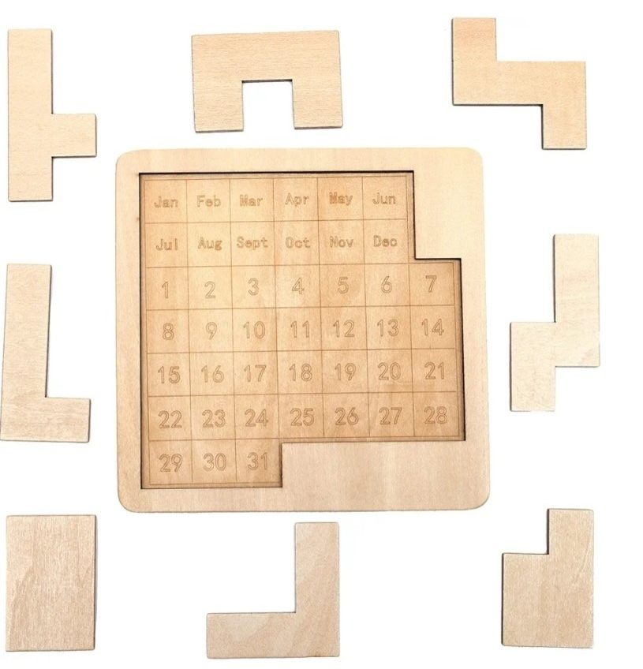

# Wooden Calendar Puzzle

A challenging and beautiful wooden calendar puzzle game created by [Your Name] with the help of ChatGPT.

## How to Play

The goal is to fit all the puzzle pieces onto the calendar board. The board represents a calendar with:

- Months (Jan-Dec) in the top two rows
- Days (1-31) in the remaining rows
- X marks for unused spaces

### Rules:
1. Drag and drop pieces from the carousel onto the board
2. Pieces can be rotated by clicking the "Rotate" button when selected
3. Pieces cannot overlap each other or go into X spaces
4. To remove a piece, drag it off the board
5. Use the Reset button to start over

### Tips:
- Start with the largest pieces first
- Pay attention to the month and day labels for strategic placement
- Rotate pieces to find the best fit
- The puzzle has multiple solutions - try different approaches!

## Controls
- **Click/Drag**: Select and place pieces
- **Rotate Button**: Rotate selected piece 90°
- **Reset Button**: Clear the board and start over
- **Arrow Buttons**: Scroll through available pieces

## About
This puzzle was inspired by traditional wooden calendar puzzles. The code was written by [Your Name] with the help of ChatGPT through a series of prompts and iterations. The design features a warm wooden aesthetic with responsive gameplay that works on both desktop and mobile devices.

Enjoy the challenge and happy puzzling!
